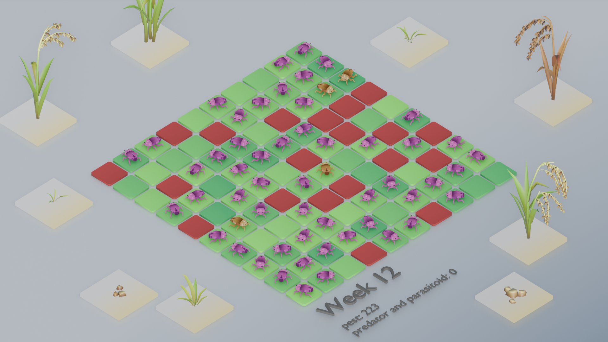
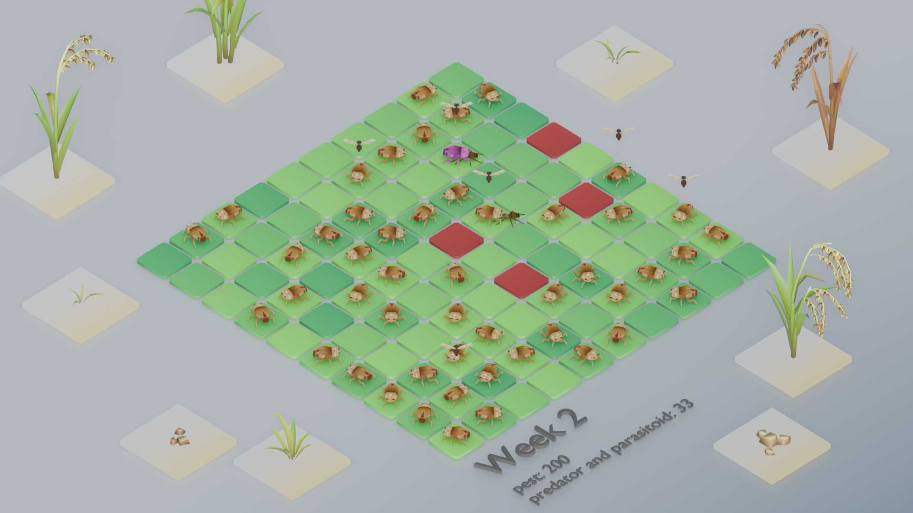

This game is based on the work of Mathilde DIONISI, Mathilde SESTER, Vira LENG, Sreymom SIENG, Florent TIVET and Myriam ADAM
With the support of Nuon THANON, Sovanna SOTHEA, Bendith TAI, Sophal KOUN
and Veng SAR

# Rice Invasion — README

This document explains **how the simulation in `App.tsx` works**, what each constant and state variable means, how the weekly update is computed, where randomness appears, what the UI shows, and how to change or extend the model.

---

## Quick overview

The app simulates populations of rice pests (normal and mutant), and their predators (parasitoids and predators) over weekly turns; each turn the model computes predation, pesticide survival, reproduction, and immigration (outside pests), then updates counts and derived UI values.

---

## Main pieces (where to look)

* `App.tsx` contains the entire core simulation and UI wiring (state, constants, `handlePesticideChoice`, rendering).
* UI components referenced from `App.tsx`: `ClickableGrid`, `LayerControls`, `PesticideControl`, `Scoreboard`, `GameOverDialog` (these are used to display field state and gather the pesticide choice).

---

## Important constants (defined at top of `App.tsx`)

These constants control the model behaviour:

* `cropsPerLayer` — how many “crop units” one layer represents.
* `initialPestCount`, `initialMutantPestCount = 10`, `initialParasitoidCount = 12`, `initialPredatorCount` — starting populations for the simulation.
* `averageOutsidePests` — used to generate random new pests entering each week.
* Reproduction and survival related constants:

  * `parasitoidReproductionRate`
  * `predatorReproductionRate`
  * `ReproductionBoost`, `MutantPestReproductionBoost` — Brown plant hopper reproduction is stimulated by pesticides. (in the simulation, the reproduction switches to the boost values, it is NOT added to current reproduction value)
  * `pestSurvivalRate`, `parasitoidSurvivalRate`, `predatorSurvivalRate`, `MutantPestPesticideSurvivalRate`.
* Consumption: `pestConsumptionRate`, `parasitoidConsumptionRate`, `predatorConsumptionRate` — Parasitoids and Predators consume pest (brown plant hopper). BPH consumes crops.

---

## Key React state variables

Declared with `useState`:

* `pestCount`, `mutantPestCount`, `parasitoidCount`, `predatorCount` — populations that evolve each turn.
* `weekNumber` — current week (starts at 1).
* `pesticideSprayCount` — number of times player applied pesticide (affects reproduction rates).
* `layersToRemove`, `layersRemoved` — damage measured in “layers” of crops to remove. `layersToRemove` is calculated from pest totals.
* `totalPestsEaten` — stores the number eaten by parasitoids+predators during the last predation step (displayed to user after week 1).

---

## The weekly update — step-by-step (inside `handlePesticideChoice`)

This is the heart of the simulation. The function runs when the user answers the pesticide prompt. The sequence:

1. **End-of-game checks**

   * If `weekNumber >= 10` and `layersToRemove === 0` or all grid cells are red, set `isGameOver`.

2. **Record pesticide usage**

   * If the user applied pesticide this week, increment `pesticideSprayCount`. That affects later reproduction rates.

3. **Determine reproduction rates**

   * Default reproduction rate for pests and mutants is `(2 * 7) / 10.42` (a constant from the code).
   * If `pesticideSprayCount > 0`, reproduction rates switch to `ReproductionBoost` and `MutantPestReproductionBoost` respectively (i.e. survivors reproduce more after pesticide use).&

4. **Calculate predation (wasps & spiders)**

   * Compute how many pests predators can eat:
     `paraEat = parasitoidCount * parasitoidConsumptionRate`
     `predEat = predatorCount * predatorConsumptionRate`
     `totalPestsEaten = min(pestTotal, paraEat + predEat)`
   * This `totalPestsEaten` is then split proportionally between normal pests and mutant pests. The model subtracts those eaten before survival/reproduction steps.

5. **Apply pesticide survival (if pesticide applied)**

   * If pesticide was applied this week, survivors are multiplied by the survival rates (`pestSurvivalRate`, etc.). Mutant pests in this model survive pesticide fully (`MutantPestPesticideSurvivalRate = 1`).

6. **Add outside pests (random immigration)**

   * `outsidePests = Math.random() * averageOutsidePests * 2` — **this is a new random value each time `handlePesticideChoice` runs**; it ranges from `0` to `averageOutsidePests * 2` (for default `averageOutsidePests = 4`, range is 0–8). That random amount is added to both `nextPestCount` and `nextMutantPestCount`. //maybe it should not be added to the second one

7. **Compute reproduction and next-week counts**

   * `nextPestCount = survivingPests * pestReproductionRate + outsidePests`
   * `nextMutantPestCount = survivingMutants * mutantPestReproductionRate + outsidePests`
   * Parasitoids and predators reproduce from their survivors using their reproduction rates.

8. **Update crops eaten, layers to remove, week number and UI state**

   * Compute `nextPestTotal = nextPestCount + nextMutantPestCount`.
   * `cropsEaten = nextPestTotal * pestConsumptionRate` and `newLayersToRemove` is computed using `cropsEaten` divided by `cropsPerLayer`, then adjusted by a factor that uses the number of green/yellow cells to represent visible crop state. Pests eat more from healthy crops. Finally state setters run: `setPestCount`, `setMutantPestCount`, `setParasitoidCount`, `setPredatorCount`, `setLayersToRemove`, `setWeekNumber(prev => prev + 1)`, and `setTotalPestsEaten(Math.ceil(totalPestsEaten))`.

---

## Randomness: where and when

All population numbers are on the form of Math.random * intendedAverageNumber * 2
Just remove the Math.random if you want a fixed starting population.

---

## UI behavior & when things appear

* The pesticide question (`PesticideControl`) appears only when `layersToRemove === 0` and `!isGameOver`. The player must answer to advance the simulation.
* After week 1 (i.e., when `weekNumber > 1`) the UI shows the last `totalPestsEaten`.
* The `ClickableGrid` shows visible cells (green/yellow/red) and affects `greenCells`/`yellowCells`, which factor into damage calculation.

---

## How to play 

Click here ! 
s-poony.github.io/Rice-Clicker/

---

## How to change common behaviours

* **Make outside pests deterministic**: replace `Math.random() * averageOutsidePests * 2` with a fixed value or a seeded RNG.
* **Make mutations/pesticide effects different**: change `MutantPestReproductionBoost`, `MutantPestPesticideSurvivalRate`, or `ReproductionBoost`.
* **Change how crops → layers is calculated**: edit the `newLayersToRemove` formula; be aware it uses `greenCells` and `yellowCells` to scale damage relative to visible field state.

---

## Potential improvements / correctness notes (things to consider)

* **State update order & stale values**: `pesticideSprayCount` is incremented earlier in the function with `setPesticideSprayCount`. But the code reads `pesticideSprayCount` later in the same function; because `setState` is asynchronous, the old value (before this increment) will be used on the same tick. If you want the increment to affect reproduction in the same week, compute a local value first (e.g., `const pesticideCountNext = pesticideSprayCount + (pesticideApplied ? 1 : 0)`), and use that in calculations. This avoids off-by-one logic errors.

* **Fun ToDo list**

- [ ] Add tutorial popup
- [x] Show # of pests eaten by predators and parasitoids every week
- [ ] Show # of insects killed by last pesticide spray
- [ ] Tips button
	- [ ] random unseen tip every time you click
	- [ ] add all tips to the read me (they explain the simulation)
- [ ] Add agro-ecological methods next to pesticide
	- [ ] plant repellent flowers
		- [ ] random green cell becomes purple
		- [ ] outsidePest - repellentForce * purple cells
	- [ ] Apply mulches
		- [ ] outsidePredator + 2
	- [ ] assess insect diversity
		For current week, display: 
		- [ ] pestTotal * 10 / insectTotal
		- [ ] parasitoidCount * 10 / insectTotal
		- [ ] predatorCount * 10 / insectTotal
	- [ ] Add wasps
	- [ ] Buy more land
		- [ ] cropsPerLayers * 2
- [ ] Add money system
	- [ ] leftover after 10 weeks stays in next game
- [ ] Improve share score system
	- [ ] If you get the link from someone who has good insects in your field, you will have more good insects in yours (insects travel between neighboring fields)

* **Floating point drift**: populations are kept as floating numbers; you may want to clamp to integers or minima (e.g., `Math.max(0, Math.round(...))`) depending on how you want to present values.
* **Random seedability**: to reproduce runs use a seeded PRNG instead of `Math.random()`.

---

