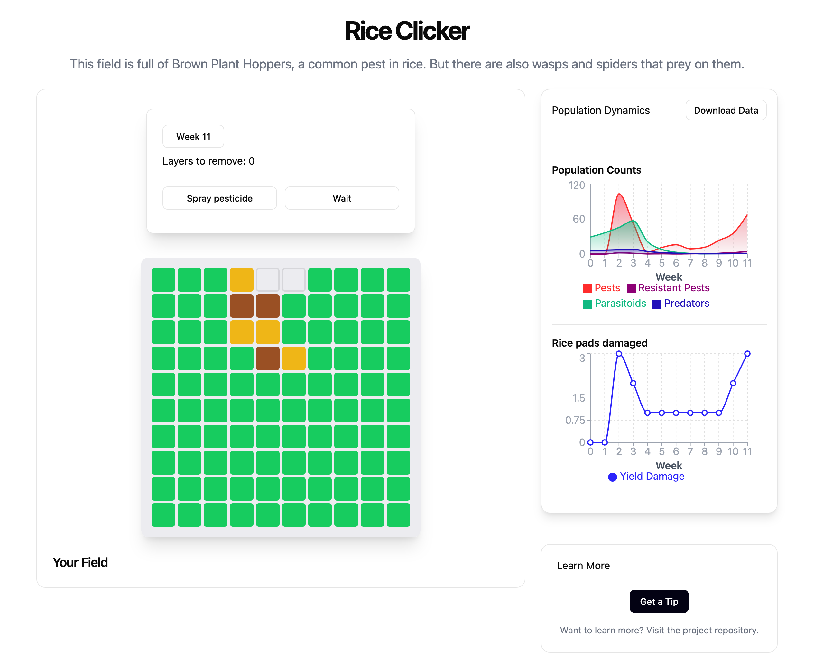

## About The Project

Rice Clicker is an educational game designed to make the principles of pest management accessible and engaging. Players take on the role of a rice farmer facing an infestation of Brown Plant Hoppers (BPH).

The goal is to survive 12 weeks until harvest with the highest possible yield. To do this, you must balance the use of chemical pesticides against more sustainable methods, observing their long-term effects on the ecosystem, including the rise of pesticide-resistant pests and the impact on beneficial insects.

This project was developed in collaboration with scientists to create a simulation that is both fun to play and scientifically grounded
This game simulates the population dynamics of rice pests and their natural enemies, letting players test pest management strategies such as pesticide use or agroecological methods. It is inspired by the work of Mathilde DIONISI, Mathilde SESTER, Vira LENG, Sreymom SIENG, Florent TIVET, and Myriam ADAM, with the support of Nuon THANON, Sovanna SOTHEA, Bendith TAI, Sophal KOUN, and Veng SAR.

---
## Key Features



- **Interactive Simulation:** Experience a week-by-week simulation of pest and beneficial insect population dynamics.
    
- **Strategic Choices:** Decide when to spray pesticides, plant flowers to encourage natural predators, or wait and see.
    
- **Pesticide Resistance:** Witness the consequences of overuse as resistant "mutant" pests begin to dominate the population.
    
- **Click-to-Harvest Mechanic:** Manually "remove" layers of rice damaged by pests, directly connecting pest population to yield loss.
    
- **Data Visualization:** Track the populations of pests, resistant pests, parasitoids (wasps), and predators (spiders) on an interactive graph powered by Recharts.
    
- **Data Export:** Download the complete simulation data as a `.csv` file at any time for further analysis in external programs.
    
- **Educational Pop-ups:** Receive tips and warnings based on the state of your field's ecosystem.

## How to Play

1. **Week 0 (Setup Phase):** The game begins before the pests arrive. You have one initial choice:
    
    - **Plant Flowers:** Boosts the initial population of beneficial insects (parasitoids) and encourages their immigration, giving you a head start on biological control.
        
    - **Wait:** Take no action and proceed to the first week.
        
2. **Pest Invasion (Week 2):** Brown Plant Hoppers (normal and resistant) arrive in your field. They will begin to eat your rice plants.
    
3. **Weekly Tasks:** Each week, you must complete two steps:
    
    - **Step 1: Remove Damage:** The pests will cause a certain number of "Layers to Remove." You must click on the healthy (green) or damaged (yellow) rice pads in the grid until the counter reaches zero. This simulates the labor and yield loss from pest damage.
        
    - **Step 2: Make a Choice:** Once the damage is cleared, buttons will appear allowing you to decide your strategy for the _next_ week: **Spray Pesticide** or **Wait**.
        
4. **The Goal:** Survive for 12 weeks until the harvest. Your final score is your total yield in tons of rice. Try to get the highest score while managing the pest population effectively!
    

---
## Getting Started (Local Development)

To run a local copy of Rice Clicker for development or testing, follow these steps.

### Prerequisites

- Node.js (v16 or later)
    
- npm
 

### Installation

1. Clone the repository:
    
    Bash
    
    ```
    git clone https://github.com/S-poony/Rice-Clicker.git
    ```
    
2. Navigate to the project directory:
    
    Bash
    
    ```
    cd Rice-Clicker
    ```
    
3. Install NPM packages:
    
    Bash
    
    ```
    npm install
    ```
    
4. Start the development server:
    
    Bash
    
    ```
    npm run dev
    ```


## Main Components

* **`App.tsx`** — core simulation logic and UI composition.
* **`ClickableGrid.tsx`** — visual grid showing crop health; integrates flower borders when agroecology is active.
* **`LayerControls.tsx`** — displays current week, crop damage layers, and hosts the `PestControl` options.
* **`PestControl.tsx`** — player actions: *Spray pesticide*, *Wait*, and (in week 0) *Plant flowers*.
* **`Graph.tsx`** — visualizes pest and predator populations and yield damage across weeks; includes a CSV download button.
* **`GameOverDialog.tsx`** — displays end-game score, replay options, and a “Download Data” button for the final dataset.

---

## Key Constants (from `App.tsx`)

| 
|Constant|Meaning|
|---|---|
|`cropsPerLayer`|Number of crop units per layer of damage|
|`initialPestCount`, `initialMutantPestCount`, `initialParasitoidCount`, `initialPredatorCount`|Starting populations|
|`averageOutsidePests`|Average number of new pests entering per week|
|`parasitoidReproductionRate`, `predatorReproductionRate`|Natural enemy reproduction rates|
|`ReproductionBoost`, `MutantPestReproductionBoost`|Boosts triggered after pesticide use|
|`pestSurvivalRate`, `parasitoidSurvivalRate`, `predatorSurvivalRate`, `MutantPestPesticideSurvivalRate`|Survival rates after pesticide application|
|`pestConsumptionRate`, `parasitoidConsumptionRate`, `predatorConsumptionRate`|Feeding rates (crop damage and predation)|

## State Variables

* **Population states:**
  `pestCount`, `mutantPestCount`, `parasitoidCount`, `predatorCount`
* **Game flow:**
  `weekNumber`, `isGameOver`, `pesticideSprayCount`
* **Crop status:**
  `layersToRemove`, `layersRemoved`, `totalPestsEaten`
* **Visuals:**
  `buttonStates` (grid cells), `flower` (true if flowers planted)
* **Simulation history:**
  Stored as an array of `WeekData` objects:

  ```ts
  {
    week, normalPestCount, mutantPestCount,
    parasitoidCount, predatorCount,
    Pest_Immigration, yieldDamage, pesticideScheduled
  }
  ```

---

## Simulation Cycle (`handlePesticideChoice`)

Each player action triggers:

1. **End-game check**
2. **Record pesticide use** 
3. **Set reproduction rates** (boosted if pesticides were used)
4. **Compute predation** (parasitoids and predators eat pests)
5. **Apply survival and reproduction**
6. **Add random outside pests**
   (`Math.random() * averageOutsidePests * 2`)
7. **Compute yield loss** → updates `layersToRemove` and grid colors
8. **Increment week**


## Graphs and Data Export

The **Population Graph** (`Graph.tsx`) plots:

* Pest populations (normal and resistant)
* Natural enemies (parasitoids, predators)
* Yield damage over time

Each chart uses Recharts and includes a **Download Data** button.
The same CSV export is available in the **Game Over Dialog**, letting players save their entire simulation history.

---

## Agroecological Features

* **Plant flowers** (week 0 only): Activates flower borders and modifies field display.
  *(Effects on pest dynamics can be extended via `onFlower` logic in `App.tsx`.)*

---

## Randomness

**Initial setup**
The initial pest, mutant, parasitoid, and predator populations are randomized at the start of the game using the helper function `randomize(value)`, which internally multiplies the given base count by a random factor (typically between 0 and 2). It is the **main source of randomness** in the model. Setting `POPULATION_RANDOMNESS` to 0 removes most randomness from the game.

**Weekly immigration**
Every turn, a new random number of _outside pests_ enter the field. This value ranges from `0` to `2 × averageOutsidePests`.
